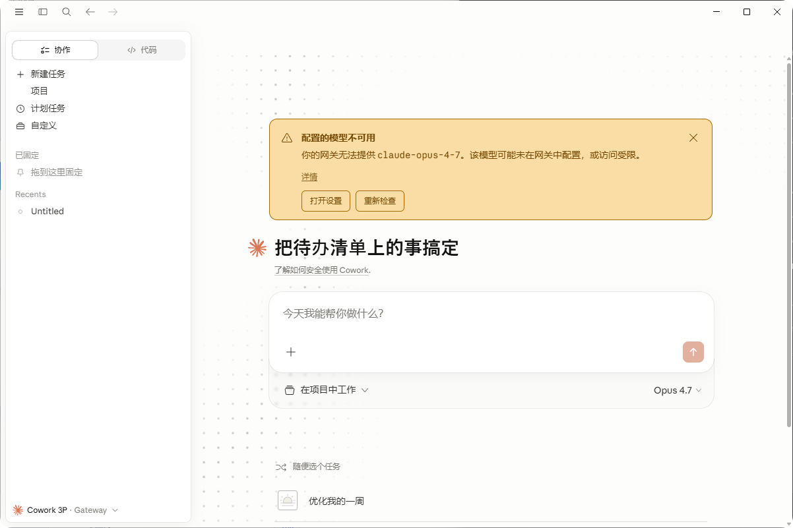
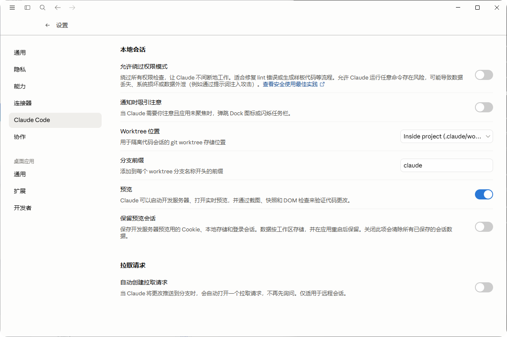

# Claude Desktop 简体中文补丁

Windows 版 Claude Desktop 简体中文汉化补丁。适用于官方 MSIX / WindowsApps 安装版。

> 当前测试版本：Claude Desktop `1.6259.1`

## 效果截图





## 已汉化范围

- 桌面端外壳菜单、语言菜单、设置入口。
- Claude / Cowork / Code 左侧导航。
- Cowork 首页、输入框、任务建议、模型错误提示。
- 设置页常见选项，包括通用、隐私、能力、连接器、Claude Code、Cowork、桌面应用、扩展、开发者等页面。
- 部分语言表无法覆盖的硬编码前端文案。

说明：已有会话标题、项目名、用户自定义名称不会被强制翻译，例如 `old`、`Untitled`、历史会话标题等仍可能保留原名。

## 下载

从 GitHub Release 下载：

[claude-desktop-zh-cn-patch-1.6259.1.zip](https://github.com/guhaigg/claude-desktop-zh-cn-patch/releases/download/v1.6259.1/claude-desktop-zh-cn-patch-1.6259.1.zip)

仓库地址：

[https://github.com/guhaigg/claude-desktop-zh-cn-patch](https://github.com/guhaigg/claude-desktop-zh-cn-patch)

## 安装

### 方式一：双击安装

解压 Release zip 后，双击：

```text
install-uac.vbs
```

同意 UAC 后脚本会：

1. 自动定位官方 Claude Desktop 安装目录。
2. 备份原始资源文件。
3. 写入中文语言包和硬编码文案补丁。
4. 将 Claude 配置中的语言设置为 `zh-CN`。
5. 自动重启 Claude。

### 方式二：管理员 PowerShell

在仓库目录执行：

```powershell
powershell -ExecutionPolicy Bypass -File .\install.ps1
```

可选参数：

```powershell
# 不自动重启 Claude
powershell -ExecutionPolicy Bypass -File .\install.ps1 -NoRestart

# 只安装 zh-CN，不覆盖 en-US 槽位
powershell -ExecutionPolicy Bypass -File .\install.ps1 -NoForceEnglishSlot

# 手动指定 Claude app 目录
powershell -ExecutionPolicy Bypass -File .\install.ps1 -ClaudeAppDir "C:\Program Files\WindowsApps\Claude_...\app"
```

## 卸载 / 恢复

双击：

```text
restore-uac.vbs
```

或在管理员 PowerShell 中执行：

```powershell
powershell -ExecutionPolicy Bypass -File .\restore.ps1
```

默认会使用最近一次安装时生成的备份。也可以指定备份目录：

```powershell
powershell -ExecutionPolicy Bypass -File .\restore.ps1 -BackupDir ".\backups\claude-desktop-language.20260507-123456"
```

## 目录结构

```text
patch/
  resources/
    zh-CN.json
    en-US.json
    ion-dist/
      i18n/
        zh-CN.json
        en-US.json
      assets/v1/
        *.js
docs/
  screenshots/
    home.png
    settings-claude-code.png
install.ps1
restore.ps1
install-uac.vbs
restore-uac.vbs
scripts/
  verify.ps1
  build-release.ps1
```

文件说明：

- `patch/resources/zh-CN.json`：桌面端外壳中文语言包。
- `patch/resources/en-US.json`：中文覆盖版英文槽位，用于处理仍走 `en-US` 的界面。
- `patch/resources/ion-dist/i18n/*.json`：Claude 主界面语言表。
- `patch/resources/ion-dist/assets/v1/*.js`：少量硬编码英文文案补丁。
- `install.ps1`：安装补丁并生成备份。
- `restore.ps1`：从备份恢复。
- `install-uac.vbs` / `restore-uac.vbs`：触发 UAC 的双击启动器。

## 校验

```powershell
powershell -ExecutionPolicy Bypass -File .\scripts\verify.ps1
```

校验内容：

- 补丁文件存在。
- 语言 JSON 合法。
- 关键翻译 key 存在。
- 硬编码资源补丁存在，且不包含已知残留英文。
- 仓库中不包含明显 API key / token 字符串。

## 打包 Release

```powershell
powershell -ExecutionPolicy Bypass -File .\scripts\build-release.ps1 -Version 1.6259.1
```

输出：

```text
dist/claude-desktop-zh-cn-patch-1.6259.1.zip
```

## 常见问题

### 为什么需要管理员权限？

官方 Claude Desktop 安装在 `C:\Program Files\WindowsApps`，该目录默认受 Windows 保护，写入资源文件需要管理员权限。

### 为什么同时覆盖 `zh-CN.json` 和 `en-US.json`？

Claude Desktop 目前有些界面仍然读取英文槽位，单独添加 `zh-CN.json` 不一定能覆盖所有界面。默认安装会同时覆盖 `en-US.json`，以保证汉化范围更完整。

如果你只想保留英文槽位，可以使用：

```powershell
powershell -ExecutionPolicy Bypass -File .\install.ps1 -NoForceEnglishSlot
```

### Claude 更新后还有效吗？

不一定。Claude 更新可能覆盖语言文件，也可能改变前端 chunk 文件名。更新后如果界面恢复英文，请重新运行 `install.ps1`。如果版本变化较大，需要重新适配资源文件。

### 这是官方插件吗？

不是。Claude Desktop 当前的插件系统不能修改主界面语言资源，所以本项目通过资源覆盖实现汉化。

### 会改 API Key 或账号数据吗？

不会。脚本只处理语言资源和语言配置，不读取、不写入、不上传 API key、账号凭据、会话内容或 Claude Code 配置。

## 已知限制

- 历史会话标题、项目名、用户输入内容不会自动翻译。
- 部分非常深层的实验功能、远程错误信息、动态服务端返回文案可能仍是英文。
- 补丁与 Claude Desktop 版本强相关，目前按 `1.6259.1` 制作。

## License

MIT
