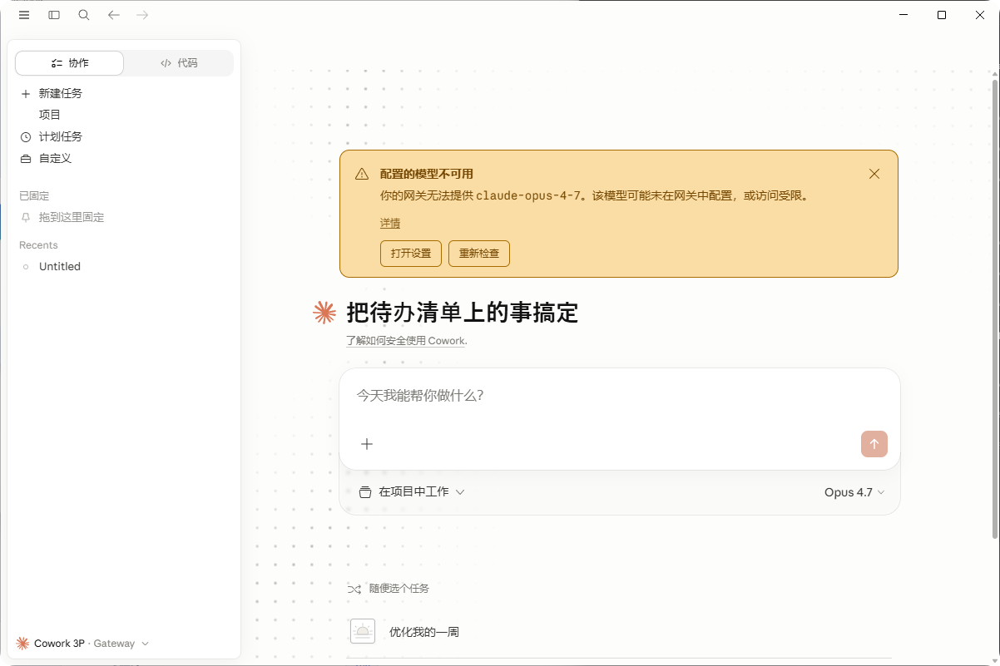

# Claude Desktop 简体中文补丁

Claude Desktop 简体中文补丁。项目只修改本机已经安装好的官方 Claude Desktop 资源文件，不包含、不分发、不替换 Claude Desktop 本体。

致谢：https://linux.do/

## 当前状态

- 适配版本：Claude Desktop `1.9659.2`
- Windows：已在 Claude Desktop `1.9659.2` 上实机验证
- macOS / Linux：使用同一套 Electron 资源补丁逻辑，脚本已适配，但仍建议在对应系统实机复测
- 发布内容：只包含补丁资源、安装脚本、恢复脚本和验证脚本
- 不再依赖固定前端 chunk 文件名，改为安装时扫描当前版本资源并按内容替换

## 重要说明

本项目不是 Claude Desktop 安装包，也不是 Claude 插件。

使用前请先安装官方 Claude Desktop 完整版：

- Windows：官方 Claude Desktop
- macOS：官方 Claude Desktop
- Linux：如果使用非官方/社区打包版本，需要手动指定 Claude 的 `resources` 目录

补丁默认会同时写入：

- `zh-CN` 语言文件
- `en-US` 槽位的中文覆盖文件

这是因为 Claude Desktop 部分界面仍可能读取英文槽位。若你不想覆盖 `en-US`，可以使用 `-NoForceEnglishSlot` 或 `--no-force-english-slot`。

## 效果截图




## 汉化范围

补丁覆盖两类文本：

1. 语言表文本
   - `resources/*.json`
   - `resources/ion-dist/i18n/*.json`
   - `resources/ion-dist/i18n/statsig/*.json`

2. 前端硬编码文本
   - 安装时扫描 `resources/ion-dist/assets/v1/*.js`
   - 根据 `patch/hardcoded-replacements.json`
   - 根据 `patch/source-translations.json`
   - 根据 `patch/manual-translations.json`
   - 对当前版本实际存在的文案做内容级替换

已覆盖的典型界面包括：

- 左侧导航
- 新建任务
- 项目 / 固定 / 最近
- Cowork 首页
- Cowork 任务页
- 计划任务页
- 自定义 / Skills / 连接器 / 插件
- 设置页
- Claude Code 设置项
- 输入框、按钮、提示、错误文案
- 部分模型和网关错误提示

## 下载

从 GitHub Release 下载对应平台的补丁包：

- `claude-desktop-zh-cn-patch-windows-<version>.zip`
- `claude-desktop-zh-cn-patch-macos-<version>.tar.gz`
- `claude-desktop-zh-cn-patch-linux-<version>.tar.gz`

仓库地址：

https://github.com/guhaigg/claude-desktop-zh-cn-patch

## 环境要求

- 已安装官方 Claude Desktop
- 已安装 Node.js
  - 建议 Node.js `18+`
  - 脚本通过 `node` 命令运行核心补丁逻辑
- Windows 如果 Claude 安装在受保护目录，可能需要管理员权限

## Windows 安装

### 方式一：双击安装

解压 Windows zip 后双击：

```text
install-uac.vbs
```

这个入口会通过 UAC 以管理员权限运行 `install.ps1`。

### 方式二：PowerShell 安装

在补丁目录执行：

```powershell
powershell -ExecutionPolicy Bypass -File .\install.ps1
```

常用参数：

```powershell
# 不自动重启 Claude
powershell -ExecutionPolicy Bypass -File .\install.ps1 -NoRestart

# 不覆盖 en-US 槽位，只写 zh-CN
powershell -ExecutionPolicy Bypass -File .\install.ps1 -NoForceEnglishSlot

# 手动指定 Claude app 目录或 resources 目录
powershell -ExecutionPolicy Bypass -File .\install.ps1 -ClaudeAppDir "C:\Users\you\AppData\Local\AnthropicClaude\app-1.9659.2"

# 只预演，不写入文件
powershell -ExecutionPolicy Bypass -File .\install.ps1 -DryRun
```

### Windows 路径说明

脚本会自动尝试查找：

```text
C:\Users\<you>\AppData\Local\AnthropicClaude\app-<version>\resources
C:\Program Files\WindowsApps\Claude_<version>_x64__pzs8sxrjxfjjc\app\resources
```

如果自动查找失败，请用 `-ClaudeAppDir` 手动指定。

如果你安装的是 WindowsApps / MSIX 版本，目录可能受系统保护。遇到 `EPERM`、`Access denied` 或写入失败时，请使用 `install-uac.vbs` 或管理员 PowerShell。某些系统策略下仍可能禁止直接修改 WindowsApps 目录，这时建议改用官方普通桌面安装目录或手动指定可写的 Claude 资源目录。

## macOS 安装

解压 macOS 包后：

```bash
chmod +x ./install.sh ./restore.sh
./install.sh
```

脚本会自动尝试查找：

```text
/Applications/Claude.app/Contents/Resources
~/Applications/Claude.app/Contents/Resources
```

手动指定路径：

```bash
./install.sh --app-dir "/Applications/Claude.app"
```

常用参数：

```bash
# 不自动重启
./install.sh --no-restart

# 不覆盖 en-US 槽位
./install.sh --no-force-english-slot

# 只预演，不写入文件
./install.sh --dry-run
```

如果 `/Applications/Claude.app` 权限不足，请使用管理员权限执行，或先确认当前用户对 Claude.app 有写入权限。

## Linux 安装

Linux 版适用于存在 Claude Desktop Electron 资源目录的安装方式。

解压 Linux 包后：

```bash
chmod +x ./install.sh ./restore.sh
./install.sh
```

脚本会自动尝试查找：

```text
~/.local/share/Claude/resources
~/.config/Claude/resources
/opt/Claude/resources
/usr/lib/Claude/resources
/usr/lib64/Claude/resources
```

如果没找到，请手动指定：

```bash
./install.sh --app-dir "/path/to/Claude/resources"
```

Linux 没有统一官方安装路径，所以 `--app-dir` 是最稳的方式。

## 恢复 / 卸载补丁

安装补丁时会在 `backups/` 目录生成备份。恢复时默认使用最近一次备份。

### Windows

双击：

```text
restore-uac.vbs
```

或执行：

```powershell
powershell -ExecutionPolicy Bypass -File .\restore.ps1
```

指定备份目录：

```powershell
powershell -ExecutionPolicy Bypass -File .\restore.ps1 -BackupDir ".\backups\claude-desktop-language.2026-06-01-120000"
```

### macOS / Linux

```bash
./restore.sh
```

指定备份目录：

```bash
./restore.sh --backup-dir "./backups/claude-desktop-language.2026-06-01-120000"
```

## 校验

基础校验：

```powershell
powershell -ExecutionPolicy Bypass -File .\scripts\verify.ps1
```

校验内容包括：

- 补丁 JSON 是否存在
- 补丁 JSON 是否合法
- `zh-CN` / `en-US` key 数量是否一致
- statsig 语言表是否完整
- 硬编码替换表是否存在
- 是否包含明显 API key / secret

对实际 Claude 安装目录做 dry-run 校验：

```powershell
powershell -ExecutionPolicy Bypass -File .\scripts\verify.ps1 -AppDir "C:\Users\you\AppData\Local\AnthropicClaude\app-1.9659.2"
```

macOS / Linux 可直接调用 Node：

```bash
node ./scripts/verify-patch.mjs --app-dir "/Applications/Claude.app"
```

## 从新版 Claude 同步语言表

Claude Desktop 更新后，可以基于当前安装目录重新同步语言表：

```powershell
node .\scripts\sync-from-installed.mjs --app-dir "C:\Users\you\AppData\Local\AnthropicClaude\app-1.9659.2"
```

同步策略：

- 使用当前版本 `en-US.json` 作为最新 key 基线
- 保留旧补丁里已经存在的翻译
- 优先应用 `patch/manual-translations.json`
- 再应用 `patch/source-translations.json`
- 新增但未翻译的 key 暂时回落为英文

## 打包 Release

```powershell
powershell -ExecutionPolicy Bypass -File .\scripts\build-release.ps1 -Version 1.9659.2
```

输出：

```text
dist/claude-desktop-zh-cn-patch-windows-1.9659.2.zip
dist/claude-desktop-zh-cn-patch-macos-1.9659.2.tar.gz
dist/claude-desktop-zh-cn-patch-linux-1.9659.2.tar.gz
dist/release-manifest-1.9659.2.json
```

Release 包只包含补丁项目文件，不包含 Claude Desktop 本体。

## 目录结构

```text
patch/
  hardcoded-replacements.json
  manual-translations.json
  source-translations.json
  resources/
    zh-CN.json
    en-US.json
    ion-dist/
      i18n/
        zh-CN.json
        en-US.json
        statsig/
          zh-CN.json
          en-US.json

scripts/
  apply-patch.mjs
  restore-patch.mjs
  sync-from-installed.mjs
  verify-patch.mjs
  build-release.ps1
  verify.ps1

install.ps1
restore.ps1
install.sh
restore.sh
install-uac.vbs
restore-uac.vbs
manifest.json
README.md
```

## 常见问题

### 这是官方插件吗？

不是。Claude Desktop 当前插件系统不能修改主界面语言资源。本项目通过修改本机资源文件实现中文界面。

### 会修改账号、API Key、会话内容吗？

不会。补丁只处理 Claude Desktop 的本地语言资源文件和语言配置。不会上传数据，也不会读取账号凭据。

### 为什么要覆盖 en-US？

Claude Desktop 部分界面仍会读取英文槽位。为了提高汉化覆盖率，默认会把 `en-US` 槽位也写成中文。如果不想这样做，请使用：

```powershell
powershell -ExecutionPolicy Bypass -File .\install.ps1 -NoForceEnglishSlot
```

或：

```bash
./install.sh --no-force-english-slot
```

### Claude 更新后还有效吗？

不一定。Claude 更新可能覆盖资源文件，也可能新增文案。更新后如果界面恢复英文，请重新运行安装脚本。大版本变化后可能需要重新同步语言表和补充替换词表。

### 能直接把打好补丁的 Claude 发给别人吗？

不建议，也不是本项目目标。本项目只发布补丁，不分发 Claude Desktop 本体。

## 已知限制

- Windows 已按 Claude Desktop `1.9659.2` 实机验证。
- macOS / Linux 使用同一套资源补丁逻辑，但仍需要对应系统实机复测。
- 新版新增 key 仍有部分英文回落，需要持续补翻。
- 服务端返回的动态文案、模型错误、账号状态、历史会话标题、用户自定义项目名不会全部自动翻译。
- WindowsApps / MSIX 目录受系统保护时，可能需要管理员权限，甚至可能被系统策略禁止直接修改。
- Linux 没有统一官方安装目录，通常建议手动传 `--app-dir`。

## License

MIT
